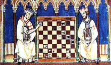

# Chess.js 

Chess is a two-player strategy board game played on a checkered board with 64 squares arranged in an 8×8 grid.
Each player begins with 16 pieces: one king, one queen, two rooks, two knights, two bishops, and eight pawns.
Each piece type moves differently, with the most powerful being the queen and the least powerful the pawn. The objective is to checkmate the opponent's king by placing it under an inescapable threat of capture.

### Pawns

Pawns can move forward up to two squares on their initial move, and only one square forward on their second move and beyond. If a pawn can be moved forward to the end of the board, it can be exchanged for any piece. In such a case it could be possible for one player to have two (or more) queens. Pawns capture diagonally one space.

### Rook

A rook can move forward, back or to either side up to as many open spaces as possible.

### Knight

A knight can move in any 'L' shaped pattern that fits within the board and whose destination isn't already occupied by a piece you own. An L is a combination of 3 spaces (one space right, 2 spaces forward) or (2 spaces right, one space forward) A knight can move left/right forward or back in an L pattern.

### Bishop

A bishop can move diagonally in any direction.

### King

A King can move in any direction one space, so long as moving to that space does not give your opponent the chance of capturing it. That would put you in check, which is not a legal move.

### Queen

A queen can move in any direction.

### Check and Checkmate.

When ever you move a piece in such a way as to be able to capture your opponents king in the next move, you say check.
When you are in check your choices of play are limited to anything that removes your king from threat of capture.  This is usually accomplished by either moving the king, or blocking the threatening pieces' path.
If you are in check and cannot make a move without remaining in check, then you have lost.

### Stalemate

Stalemate is a condition where there are no more legal moves left that will not put you in check.